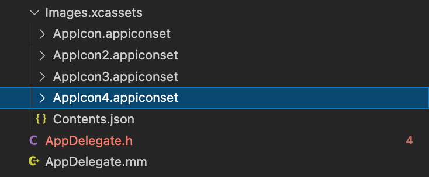
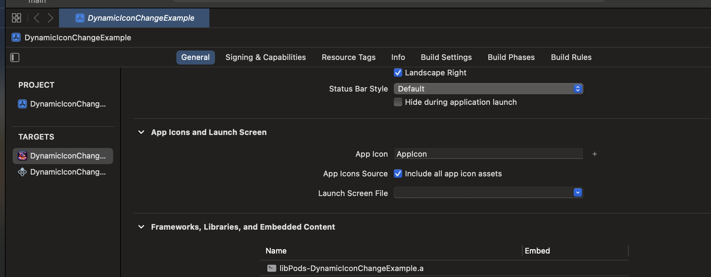
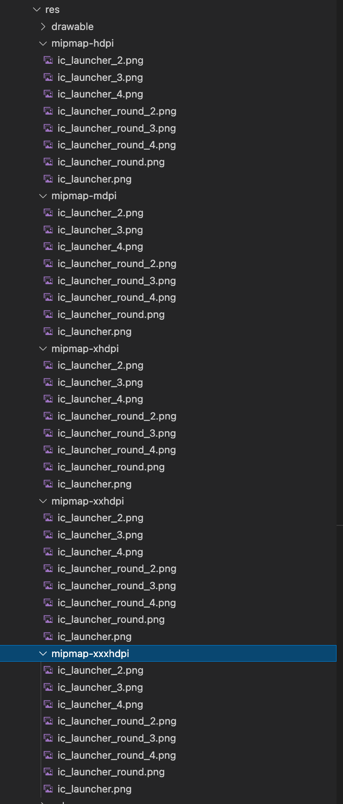

# Dynamic App Icon Manager for React Native

This library enables React Native developers to dynamically change the app icon at runtime for both iOS and Android platforms. It provides easy-to-use methods to retrieve the current app icon and switch between different icons based on user interaction or any logic within the app.

---

## Package Statistics


## Features

- Change app icon dynamically at runtime.
- Retrieve the current app icon.
- Cross-platform support (iOS and Android).

---

## Installation

```bash
npm install react-native-dynamic-icon-change
yarn add react-native-dynamic-icon-change
```

Link the native modules (if auto-linking is not enabled):

```bash
react-native link react-native-dynamic-icon-change
```

---

## Usage

### Import the Library

```javascript
import { changeAppIcon, getAppIcon } from 'react-native-dynamic-icon-change';
```

### Change App Icon

To change the app icon dynamically:

```javascript
changeAppIcon('YourIconName')
  .then((newIconName) => console.log(`Icon changed to: ${newIconName}`))
  .catch((error) => console.error('Failed to change app icon:', error));
```

- `YourIconName` should match the icon name defined in the native configuration.
- For iOS, it corresponds to the `CFBundleIconName` in the `Info.plist` file.
- For Android, it corresponds to the alias name defined in `AndroidManifest.xml`.

### Get Current App Icon

To retrieve the current app icon:

```javascript
getAppIcon()
  .then((currentIcon) => console.log(`Current app icon: ${currentIcon}`))
  .catch((error) => console.error('Failed to get current app icon:', error));
```

---

## iOS Configuration

1. Open your `Info.plist` file and define alternate icons:

```xml
<key>CFBundleIcons</key>
<dict>
  <key>CFBundlePrimaryIcon</key>
  <dict>
    <key>CFBundleIconFiles</key>
    <array>
      <string>AppIcon</string>
    </array>
    <key>UIPrerenderedIcon</key>
    <false/>
  </dict>
<key>CFBundleAlternateIcons</key>
<dict>
  <key>AppIcon2</key>
  <dict>
    <key>CFBundleIconFiles</key>
    <array>
      <string>AppIcon2</string>
    </array>
  </dict>
  <key>AppIcon3</key>
  <dict>
    <key>CFBundleIconFiles</key>
    <array>
      <string>AppIcon3</string>
    </array>
  </dict>
</dict>
</dict>
```

2. add icons to your ios file
   

3. xCode > General > App Icons and launch Screen > Include all app Icon assets will be selected
   

4. cd ios pod update cd ..

---

## Android Configuration

1. Open your `AndroidManifest.xml` file and define activity aliases for alternate icons:

```xml
<manifest xmlns:android="http://schemas.android.com/apk/res/android">

    <uses-permission android:name="android.permission.INTERNET" />
    <uses-permission android:name="android.permission.CHANGE_COMPONENT_ENABLED_STATE" />

    <application
      android:name=".MainApplication"
      android:label="@string/app_name"
      android:icon="@mipmap/ic_launcher"
      android:roundIcon="@mipmap/ic_launcher_round"
      android:allowBackup="false"
      android:theme="@style/AppTheme"
      android:supportsRtl="true">
      <activity
        android:name=".MainActivity"
        android:label="@string/app_name"
        android:configChanges="keyboard|keyboardHidden|orientation|screenLayout|screenSize|smallestScreenSize|uiMode"
        android:launchMode="singleTask"
        android:windowSoftInputMode="adjustResize"
        android:exported="true">
        <intent-filter>
            <action android:name="android.intent.action.MAIN" />
            <category android:name="android.intent.category.LAUNCHER" />
        </intent-filter>
       </activity>
            <activity-alias
            android:name=".MainActivityDefault"
            android:enabled="false"
            android:exported="true"
            android:icon="@mipmap/ic_launcher"
            android:label="@string/app_name"
            android:roundIcon="@mipmap/ic_launcher_round"
            android:targetActivity=".MainActivity">
            <intent-filter>
                <action android:name="android.intent.action.MAIN" />
                <category android:name="android.intent.category.LAUNCHER" />
            </intent-filter>
        </activity-alias>
      <activity-alias
            android:name=".MainActivityIcon2"
            android:enabled="false"
            android:exported="true"
            android:icon="@mipmap/ic_launcher_2"
            android:label="@string/app_name"
            android:roundIcon="@mipmap/ic_launcher_round_2"
            android:targetActivity=".MainActivity">
            <intent-filter>
                <action android:name="android.intent.action.MAIN" />
                <category android:name="android.intent.category.LAUNCHER" />
            </intent-filter>
        </activity-alias>
        <activity-alias
            android:name=".MainActivityIcon3"
            android:enabled="false"
            android:exported="true"
            android:icon="@mipmap/ic_launcher_3"
            android:label="@string/app_name"
            android:roundIcon="@mipmap/ic_launcher_round_3"
            android:targetActivity=".MainActivity">
            <intent-filter>
                <action android:name="android.intent.action.MAIN" />
                <category android:name="android.intent.category.LAUNCHER" />
            </intent-filter>
        </activity-alias>
    </application>
</manifest>

```

2. android > app > src > main > res add icons to your android file
   

3. cd android && ./gradlew clean && cd ..

---

## Methods

### `changeAppIcon(iconName: string): Promise<string>`

- **Parameters:**
  - `iconName`: The name of the icon to switch to.
  - Use "Default" for the primary icon.
- **Returns:**
  - A promise resolving to the name of the new icon or rejecting with an error.

### `getAppIcon(): Promise<string>`

- **Returns:**
  - A promise resolving to the name of the current icon or rejecting with an error.

---

## Error Handling

Common errors include:

- `ACTIVITY_NOT_FOUND`: The current activity is null.
- `EMPTY_ICON_STRING`: Icon name is not provided.
- `ICON_ALREADY_USED`: The icon is already active.
- `ICON_INVALID`: The specified icon name is invalid.
- `IOS:NOT_SUPPORTED`: Alternate icons are not supported on the device.

---

## Example Project

Here is a simple example demonstrating the usage:

```javascript
import React, { useEffect, useState } from 'react';
import { View, Button, Text } from 'react-native';
import { changeAppIcon, getAppIcon } from 'react-native-dynamic-icon-change';

const App = () => {
  const [currentIcon, setCurrentIcon] = useState('');

  useEffect(() => {
    getAppIcon().then(setCurrentIcon).catch(console.error);
  }, []);

  const switchIcon = (iconName) => {
    changeAppIcon(iconName)
      .then(() => setCurrentIcon(iconName))
      .catch(console.error);
  };

return (
  <View>
    <Text>Current App Icon: {currentIcon}</Text>
    <Button
      title="Change iOS Icon to Default"
      onPress={() => switchIcon(null)}
    />
    <Button
      title="Change iOS Icon to AppIcon2"
      onPress={() => switchIcon('AppIcon2')}
    />
    <Button
      title="Change iOS Icon to AppIcon3"
      onPress={() => switchIcon('AppIcon3')}
    />
    <Button
      title="Set Android Icon to Default"
      onPress={() => switchIcon('Default')}
    />
    <Button
      title="Change Android Icon to Icon2"
      onPress={() => switchIcon('Icon2')}
    />
    <Button
      title="Change Android Icon to Icon3"
      onPress={() => switchIcon('Icon3')}
    />
  </View>
);


export default App;
```

---

## Contributing

1. Fork the repository.
2. Create a new feature branch.
3. Submit a pull request with detailed changes.

---

## License

MIT License. See the `LICENSE` file for more details.

Rıdvan Üçdağ

https://github.com/ridvanucdag
https://www.linkedin.com/in/ridvanucdag
